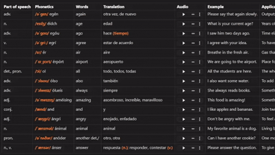
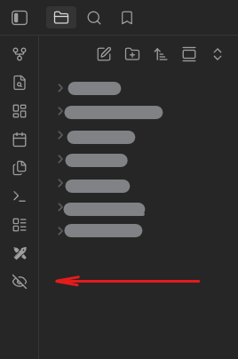

# Table Hide

Hide and reveal markdown table cells for active recall and language learning in Obsidian.

Oculta y revela celdas de tablas Markdown para práctica de memoria activa y aprendizaje de idiomas en Obsidian.



---

# English

## What is this?

Table Hide lets you hide table cells with one click.

It was made for language learning, active recall, flashcard-style studying, vocabulary practice, and similar workflows.

You can:

- Hide/show all cells with one button
- Click individual cells to reveal/hide them
- Protect columns from hiding
- Protect rows from hiding
- Keep audio columns visible while studying

Works especially well for vocabulary tables.

Example:

| word | ((audio)) | meaning |
|------|------------|----------|
| apple | ▶ | manzana |
| house | ▶ | casa |
| ((grammar)) | noun | - |

`((audio))`

→ prevents a column from being hidden.

`((grammar))`

→ prevents a row from being hidden.

---

## Features

- Toggle hide/show all table cells
- Click individual cells
- Protected columns
- Protected rows
- Markdown-native workflow
- Reading View support
- Lightweight
- No configuration required

---

## Installation

### Community Plugins (future)

Search for:

```txt
Table Hide
```

Then enable the plugin.

### Manual Installation

Copy:

```txt
main.js
manifest.json
styles.css
```

into:

```txt
.obsidian/plugins/table-hide/
```

Then restart Obsidian and enable the plugin.

---

## Usage

### Hide a column

Add:

```txt
((audio))
```

inside the header.

Example:

| word | ((audio)) |
|------|------------|
| apple | ▶ |
| house | ▶ |

The column will stay visible.

---

### Hide a row

Add:

```txt
((grammar))
```

in the first cell.

Example:

| word | meaning |
|------|---------|
| apple | manzana |
| ((grammar)) | noun |

The row will stay visible.

---

### Toggle All Visibility Button

In the left sidebar (where Obsidian’s main action buttons are located), you will find a button that allows you to quickly hide or show all content. This is useful for focusing on specific sections or resetting the view with a single click.



---

## Donations

If this plugin helped you, consider supporting development.

### PayPal

Replace this link with your PayPal:

https://paypal.me/cwblackhole


---

# Español

## ¿Qué es esto?

Table Hide te permite ocultar celdas de tablas Markdown con un clic.

Fue creado para aprendizaje de idiomas, memoria activa, vocabulario, práctica tipo flashcards y estudio en Obsidian.

Puedes:

- Ocultar/mostrar todas las celdas con un botón
- Revelar u ocultar celdas individuales
- Bloquear columnas
- Bloquear filas
- Mantener visible una columna de audio mientras estudias

Ejemplo:

| word | ((audio)) | meaning |
|------|------------|----------|
| apple | ▶ | manzana |
| house | ▶ | casa |
| ((grammar)) | noun | - |

`((audio))`

→ evita ocultar una columna.

`((grammar))`

→ evita ocultar una fila.

---

## Funciones

- Mostrar/ocultar todas las celdas
- Clic individual en celdas
- Columnas protegidas
- Filas protegidas
- Flujo natural en Markdown
- Compatible con Reading View
- Ligero
- Sin configuración

---

## Instalación

### Plugins comunitarios (futuro)

Busca:

```txt
Table Hide
```

y actívalo.

### Instalación manual

Copia:

```txt
main.js
manifest.json
styles.css
```

en:

```txt
.obsidian/plugins/table-hide/
```

Luego reinicia Obsidian y activa el plugin.

---

## Uso

### Bloquear una columna

Agrega:

```txt
((audio))
```

en el header.

Ejemplo:

| word | ((audio)) |
|------|------------|
| apple | ▶ |
| house | ▶ |

La columna permanecerá visible.

---

### Bloquear una fila

Agrega:

```txt
((grammar))
```

en la primera celda.

Ejemplo:

| word | meaning |
|------|---------|
| apple | manzana |
| ((grammar)) | noun |

La fila permanecerá visible.

---

### Botón para alternar la visibilidad

En la barra lateral izquierda (donde están los botones principales de Obsidian), encontrarás un botón llamado Bicycle Button que permite ocultar o mostrar todo el contenido rápidamente. Es útil para enfocarse en secciones específicas o reiniciar la vista con un solo clic.


---

## Donaciones

Si este plugin te ayudó y quieres apoyar el desarrollo:

### PayPal

Reemplaza este link por tu PayPal:

https://paypal.me/cwblackhole


---

## License

MIT